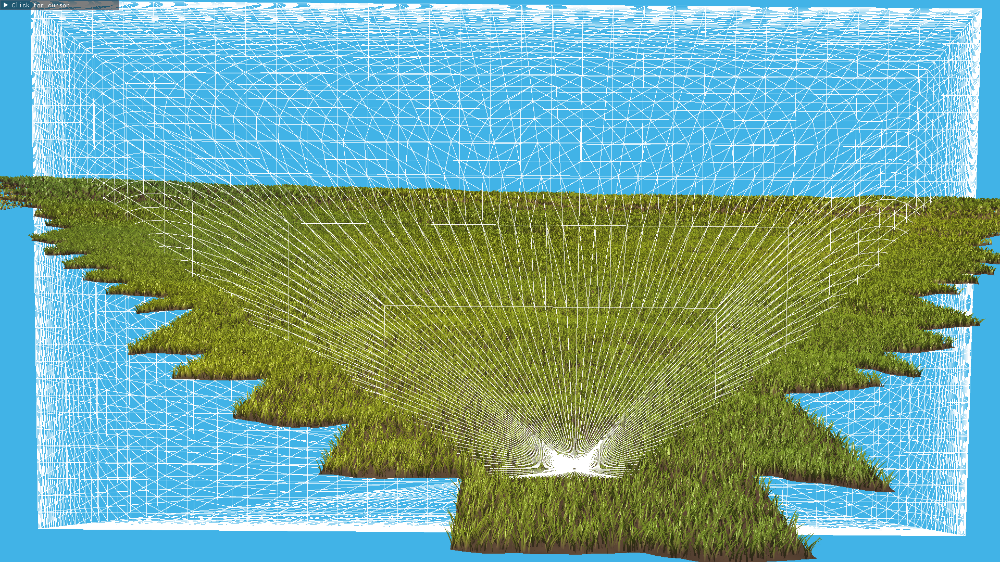

# Meadow - a grass visualization demo

## Features:

- 512x512 meters large procedurally generated grassland meadow
- Each grass blade is a separate geometry (no billboards)
- Compute shader-based frustum culling
- Simple wind simulation and blade sway animation
- Continuous LOD of grass blades
- Implemented in Vulkan 1.3

Made as a project for Advanced Computer Graphics course at BUT FIT. Graded 30/30 pts.

Technical details are explained in [documentation](https://github.com/ZADNE/Meadow/blob/master/doc.pdf).

## Preview of the demo

You can see a [**sample video on YouTube**](https://youtu.be/10An7OE2fW8) (slightly blurry due to video compression).

#### A sample screenshot of the demo

#### Tile-based frustum culling calculated in a compute prepass

#### An individual blade in debug view with vertex normals visualized

